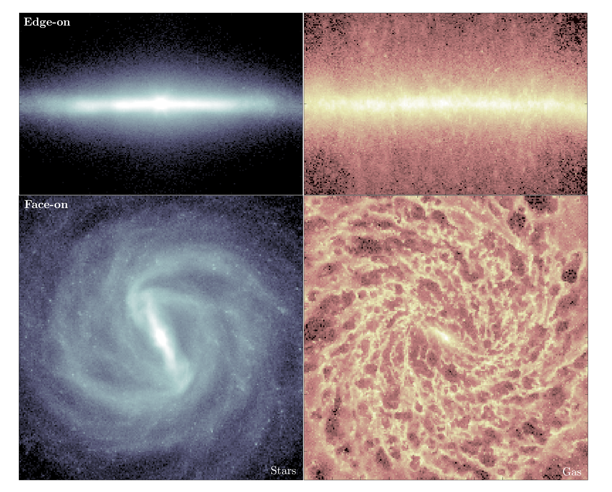

## Gallery
These simulations have been produced with the numerical smoothed particle hydrodynamics (SPH) code <a href="https://gasoline-code.com">Gasoline2</a> (code paper: <a href="https://ui.adsabs.harvard.edu/abs/2017MNRAS.471.2357W/abstract">Wadsley et al, 2017).  

### Disk Galaxies

|| **IsoB**   an isolated barred galaxy   Observed Target: NGC 4303   in: <a href="https://ui.adsabs.harvard.edu/abs/2022MNRAS.510.3899I/abstract">Iles et al, 2022</a>,  &nbsp;&nbsp;&nbsp;&nbsp;<a href="https://ui.adsabs.harvard.edu/abs/2024MNRAS.527.2799I/abstract">Iles et al, 2024</a>   &nbsp;&nbsp;&nbsp;&nbsp;&nbsp;&nbsp;&nbsp;&nbsp;&nbsp;&nbsp;&nbsp;&nbsp;&nbsp;&nbsp;&nbsp;&nbsp;&nbsp;&nbsp;&nbsp;&nbsp;&nbsp;&nbsp;&nbsp;&nbsp;&nbsp;&nbsp;&nbsp;&nbsp;&nbsp;&nbsp;&nbsp;&nbsp;&nbsp;&nbsp;&nbsp;&nbsp;&nbsp;&nbsp;&nbsp;&nbsp;&nbsp;&nbsp;&nbsp;&nbsp;&nbsp;&nbsp;&nbsp;&nbsp;&nbsp;&nbsp; |

* * *

|| **TideB**   a tidally-affected barred galaxy   Observed Target: NGC 3627   in: <a href="https://ui.adsabs.harvard.edu/abs/2022MNRAS.510.3899I/abstract">Iles et al, 2022</a>,  &nbsp;&nbsp;&nbsp;&nbsp;<a href="https://ui.adsabs.harvard.edu/abs/2024MNRAS.527.2799I/abstract">Iles et al, 2024</a>   Interaction Strength (S) = 10%   &nbsp;&nbsp;&nbsp;&nbsp;&nbsp;&nbsp;&nbsp;&nbsp;&nbsp;&nbsp;&nbsp;&nbsp;&nbsp;&nbsp;&nbsp;&nbsp;&nbsp;&nbsp;&nbsp;&nbsp;&nbsp;&nbsp;&nbsp;&nbsp;&nbsp;&nbsp;&nbsp;&nbsp;&nbsp;&nbsp;&nbsp;&nbsp;&nbsp;&nbsp;&nbsp;&nbsp;&nbsp;&nbsp;&nbsp;&nbsp;&nbsp;&nbsp;&nbsp;&nbsp;&nbsp;&nbsp;&nbsp;&nbsp;&nbsp;&nbsp;|

* * *

|| **TideNC**   an isolated barred galaxy   Observed Target: NGC 3627   in: <a href="https://ui.adsabs.harvard.edu/abs/2024MNRAS.527.2799I/abstract">Iles et al, 2024</a>   &nbsp;&nbsp;&nbsp;&nbsp;&nbsp;&nbsp;&nbsp;&nbsp;&nbsp;&nbsp;&nbsp;&nbsp;&nbsp;&nbsp;&nbsp;&nbsp;&nbsp;&nbsp;&nbsp;&nbsp;&nbsp;&nbsp;&nbsp;&nbsp;&nbsp;&nbsp;&nbsp;&nbsp;&nbsp;&nbsp;&nbsp;&nbsp;&nbsp;&nbsp;&nbsp;&nbsp;&nbsp;&nbsp;&nbsp;&nbsp;&nbsp;&nbsp;&nbsp;&nbsp;&nbsp;&nbsp;&nbsp;&nbsp;&nbsp;&nbsp;|

