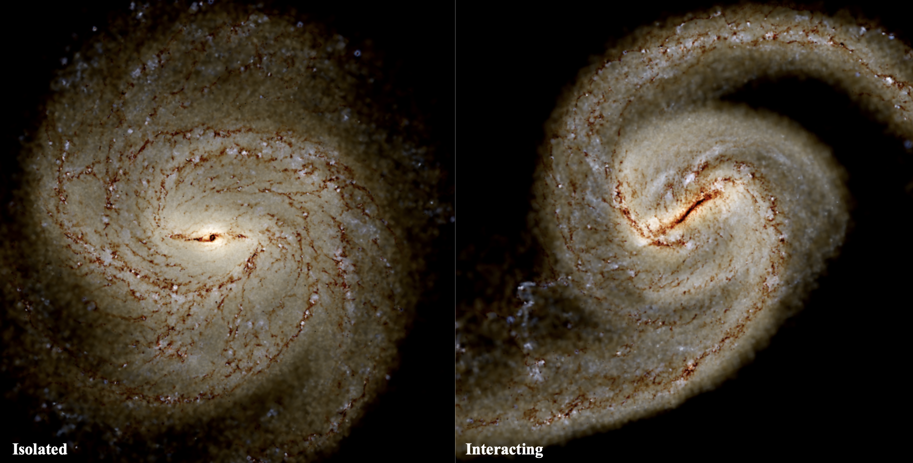

## About

Welcome to the GOANNA Simulations Project - Galaxy Observational Analogues in N-body Numerical Analysis.

This is a simulation project where we create analogues of observed galaxies to study in ways that are not possible for real galaxies.
With these simulated analogues it is possible to follow the disk evolution through time or flip an edge-on galaxy to observe its face-on features. 
We can even zoom in and zoom out to view the galaxy from inside, like our position in the Milky Way, or from outside, as if an external observer.  

These simulated galaxies are tailored via initial constraints based on observations of the real counterpart galaxy. 
The summary of these galaxies can be found on the [Gallery Page](\.gallery.md), please take a look! 
If you have a favourite galaxy to study that is not included in our sample or if you think your science could benefit from one of our existing galaxies, always feel free to get in [Contact](##Contact). 

| |
| Mock composite observation-like images produced from two simulations (IsoB - left, TideB - right).|
| IsoB is barred-spiral galaxy formed in isolation, while similar structure in TideB has been triggered |
|  by interaction with a dwarf galaxy-like companion. |

* * *

## Contact
Please feel free to reach out via the github link in the menu or the following email (removing all spaces and using the appropriate special character). 

e-mail: elizabeth . iles [at] sydney . edu . au

We welcome any collaboration requests and our data is publically available. 
